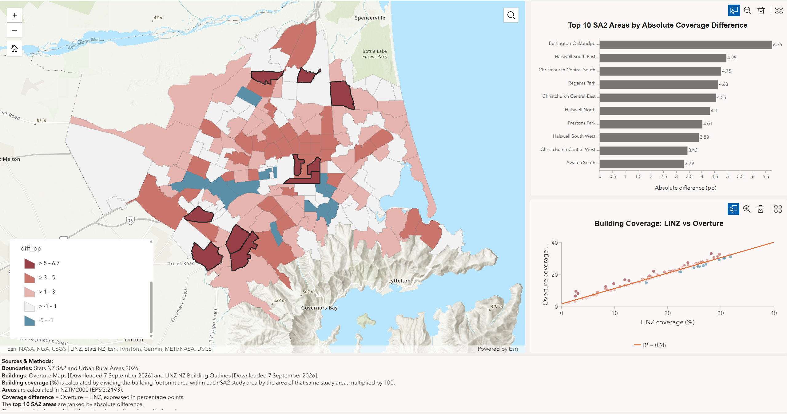
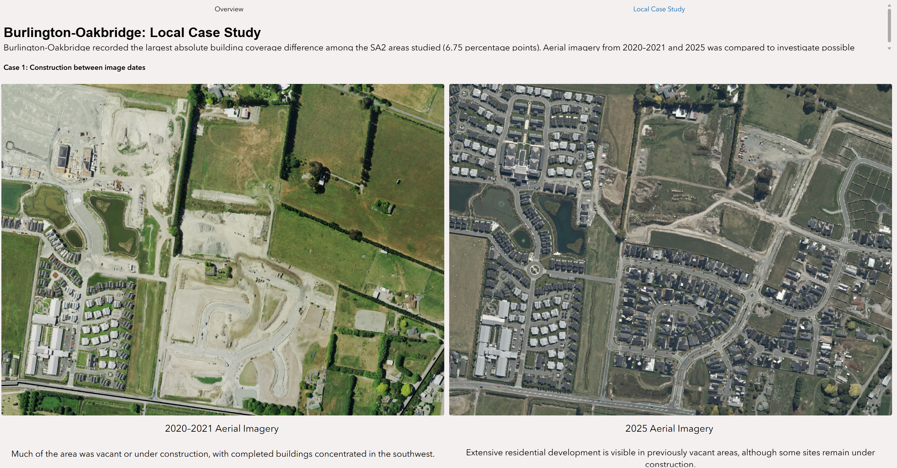
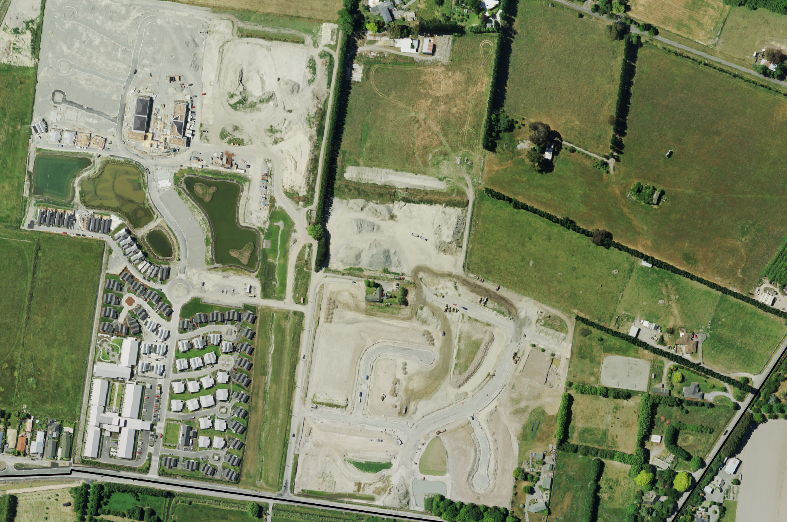
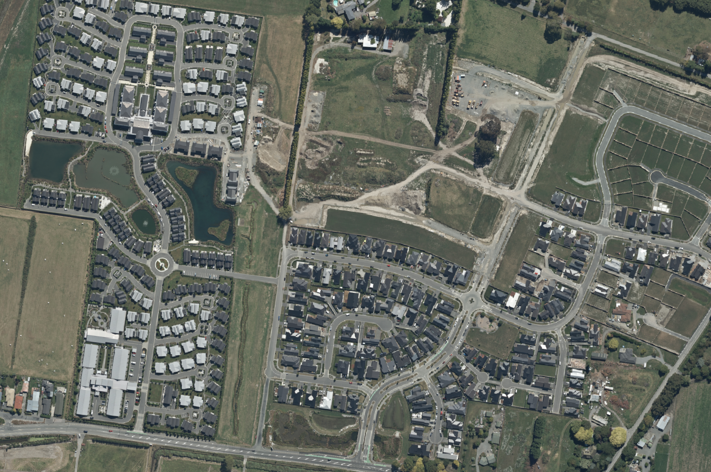
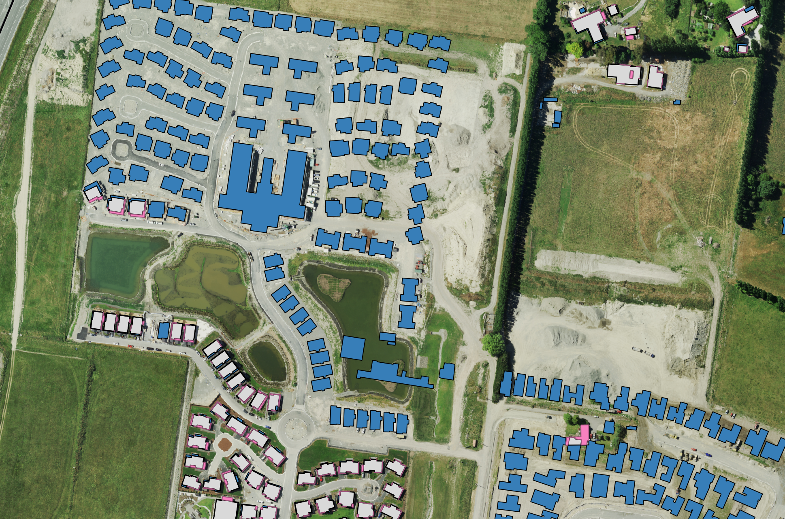
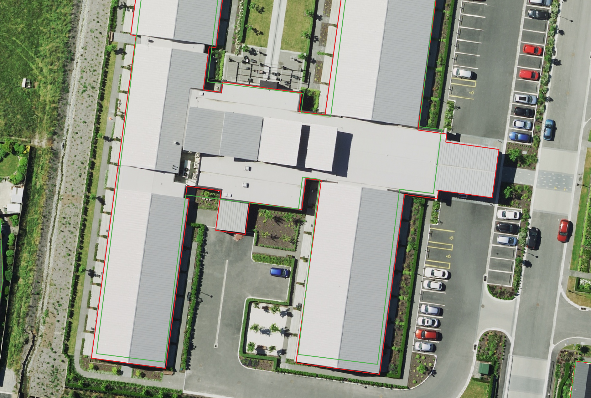
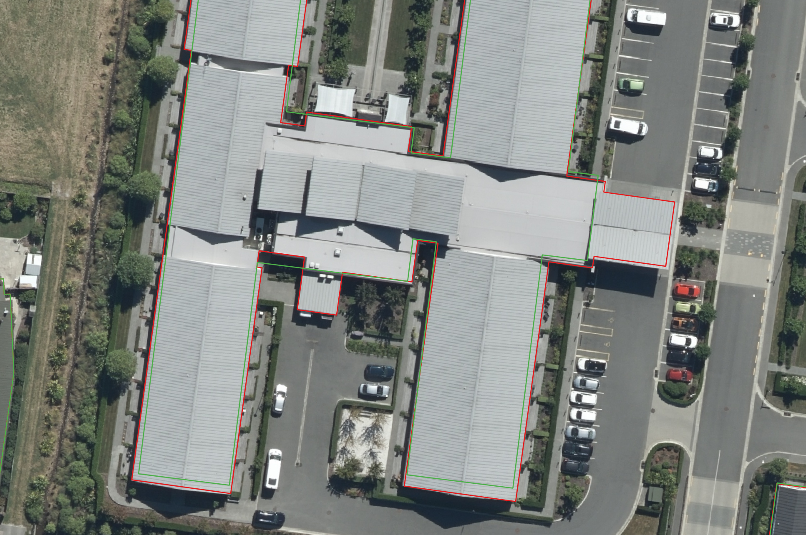
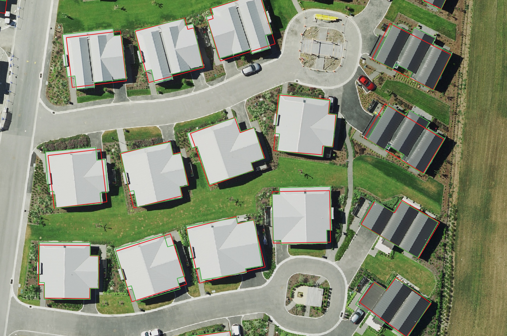
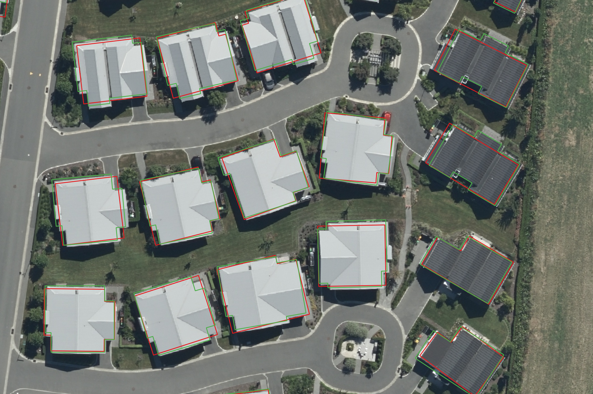

# Christchurch-SA2-Building-Coverage-Overture-Maps-vs-LINZ
A GIS comparison of building footprint coverage across Christchurch's 2026 SA2 study areas, combining citywide mapping with local aerial-imagery checks.

*Project application screenshot. The map shows signed coverage differences; black outlines identify the Top 10 areas by absolute difference. The orange scatterplot line is a fitted regression, not a line of equality.*

## Project questions

- Where do Overture and LINZ produce different building coverage estimates?
- Which areas have the largest absolute differences?
- Can dated aerial imagery help explain the observed differences?

## Approach

QGIS was used to prepare boundaries and building footprints, calculate area-based coverage, and compare local geometries. ArcGIS Online and Experience Builder were used to present the SA2 comparison and imagery case study.

The study uses the Christchurch urban study extent, rather than the entire Christchurch City administrative area. Areas are calculated in NZTM2000 (EPSG:2193).

**Building coverage (%) = 100 × building footprint area within a study polygon / area of that same study polygon.**

**Coverage difference (pp) = Overture coverage − LINZ coverage.** Positive values indicate higher Overture coverage. The Top 10 chart ranks the absolute difference.

## Results and interpretation

- Burlington-Oakbridge has the largest displayed absolute difference: **6.75 percentage points**.
- The displayed SA2 scatterplot has **R² = 0.98**. This describes the fitted linear relationship, not accuracy or agreement with ground truth.
- In the Burlington-Oakbridge case study, several areas that were vacant or under construction in 2020–2021 contain completed buildings in 2025. These correspond to clusters of Overture-only coverage, supporting data currency as one explanation for the gap.
- For buildings present in both periods, differences also include roof-section coverage, boundary detail and alignment. Individual examples favour different datasets; neither is assumed to be ground truth.

These are selected case observations, not a citywide accuracy assessment. The proportion of the coverage gap attributable to construction has not been quantified.

## Local case study

*Case-study page preview showing the navigation and paired imagery presentation. Detailed evidence and interpretations follow below.*

| Case | Evidence | Interpretation |
|---|---|---|
| Construction between image dates | Vacant/construction sites in 2020–2021 and completed housing in 2025 | Differences in the period represented by the building data |
| Roof coverage differences | Roof sections visible in both periods included in LINZ but absent from the compared Overture outline | Local outline completeness or mapping-scope differences |
| Alignment and shape | Existing buildings with different offsets and corner configurations | Positional and shape disagreement; cause not conclusively established |

The same building dataset versions are overlaid on both imagery dates. The dates do not represent separate 2020 and 2025 building releases. The 2025 imagery is a comparison reference, not a confirmed source for Overture.

### Case 1 — Construction between image dates

| 2020–2021 aerial imagery | 2025 aerial imagery |
|---|---|
|  |  |

Several vacant or developing sites in the earlier image contain completed buildings by 2025. The central large building was already partly constructed in the earlier image, so it should not be classified as wholly absent at that time.

*Coverage overlay on 2020–2021 imagery: blue = Overture only; pink = LINZ only; light grey = shared coverage. Colours indicate geometric coverage classes, not confirmed construction or demolition.*

Clusters of blue footprints correspond to several of the subsequently developed locations. Together, the imagery and overlay support data currency as an explanation for part of the SA2 coverage gap; its contribution has not been quantified.

### Case 2 — Roof coverage differences

| 2020–2021 aerial imagery | 2025 aerial imagery |
|---|---|
|  |  |

*Red = LINZ; green = Overture. Both are the original full building outlines, not the exclusive-area results.*

The roof projection on the right and the small courtyard roof are visible in both periods. LINZ includes these sections while the compared Overture outline does not. This supports a local difference in roof coverage or mapping scope rather than construction between the image dates. Better roof coverage in this example does not establish overall dataset accuracy.

### Case 3 — Outline alignment and shape

| 2020–2021 aerial imagery | 2025 aerial imagery |
|---|---|
|  |  |

*Red = LINZ; green = Overture. Screenshots show corresponding locations; they are visual comparisons, not registered measurement images.*

All four buildings are visible in both periods. The outlines differ in position and corner configuration, and a simple translation would not explain every difference. Some green outline sections more closely follow visible roof turns. Image viewing geometry and mapping conventions remain possible contributors; these screenshots alone cannot assign a definitive cause.

Pure translation preserves polygon area but reduces spatial overlap. This distinguishes local alignment disagreement from the large net coverage increase associated with newly developed areas.

**Imagery credits:** Environment Canterbury; 2020–2021 acquisition by Landpro Ltd and 2025 acquisition by Aerial Surveys. Imagery accessed via LINZ Data Service under CC BY 4.0. Images are cropped, with building overlays where shown. 

## Reproducibility and scope

This repository documents a desktop GIS workflow. It does not yet contain an executable end-to-end pipeline, the QGIS project or the original analysis layers. The ranking file is transcribed from the displayed chart, not independently recalculated from source geometry. Large source datasets and imagery are excluded.

Before interpreting the published citywide values as union-based footprint coverage, verify that overlapping buildings were not counted twice. The local case study explicitly uses separate dissolves before overlay. See the quality checks for reconciliation with the original SA2 results.

## Data rights

Third-party datasets retain their original licences. Imagery source and modification credits are provided in the source documentation. No blanket licence is applied to the underlying datasets.

